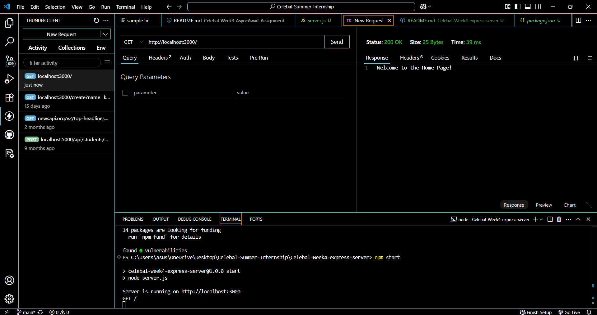
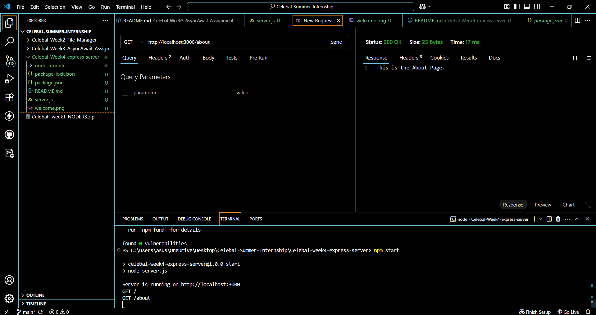
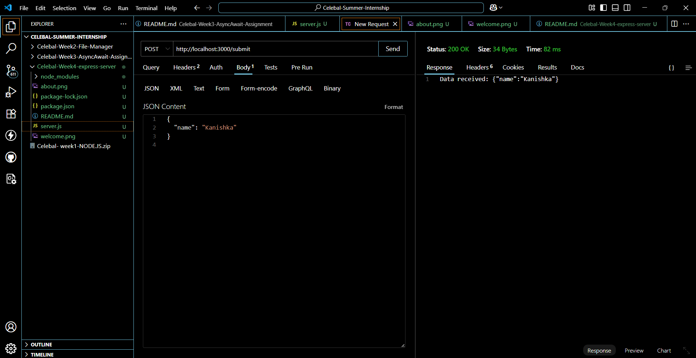

# Week 4 Assignment: Basic Express.js Web Server

## 📁 Project Structure

```
week4-express-server/
├── package.json
├── server.js
└── README.md
```

## 🚀 Setup Instructions

1. **Install dependencies**

```bash
npm install
```

2. **Run the server**

```bash
node server.js
```

The server will start at: `http://localhost:3000`

---

## 📌 Middleware Used

- **Logger Middleware**: Logs each incoming request's method and URL.
- **Body Parser Middleware**: Parses incoming JSON request bodies.

```js
app.use((req, res, next) => {
  console.log(`${req.method} ${req.url}`);
  next();
});

app.use(express.json());
```

---

## 🔀 Routing

### `GET /`

Returns a welcome message.

### `GET /about`

Returns a simple "About Page" message.

### `POST /submit`

Accepts a JSON body in the following format:

```json
{
  "name": "Kanishka"
}
```

Responds back with:

```
Data received: {"name":"Kanishka"}
```

You can test this using Postman or curl.

---

---

## 🖼️ Screenshots






## ✅ Example curl Test

```bash
curl -X POST http://localhost:3000/submit \
-H "Content-Type: application/json" \
-d '{ "name": "Kanishka" }'
```

This will output:

```
Data received: {"name":"Kanishka"}
```

---

## 👩‍💻 Author

**Kanishka Khatri**  
B.Tech CSE, Mody University of Science and Technology  
🔗 [LinkedIn Profile](https://www.linkedin.com/in/kanishka-khatri/)

📌 *Submitted for Celebal Summer Internship 2025 – Week 4 Task*