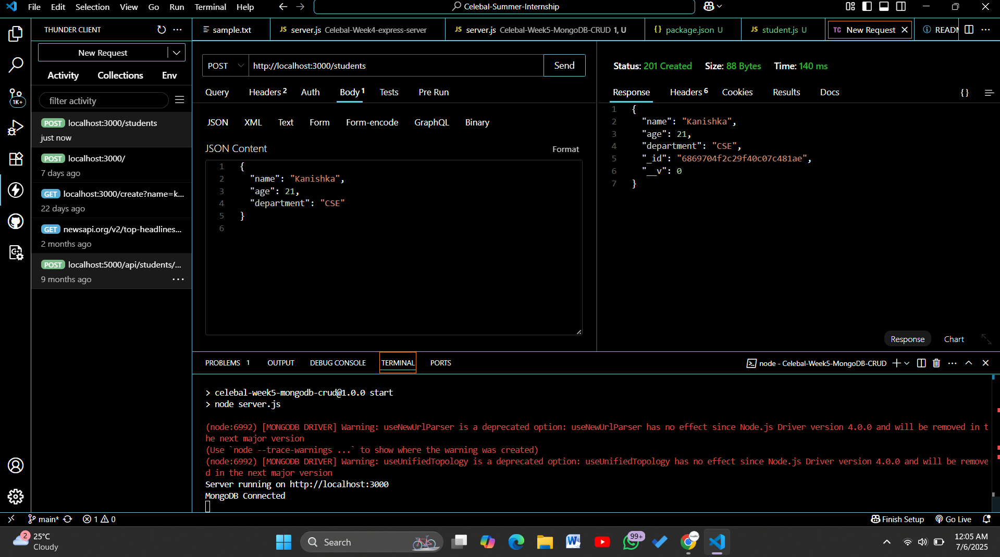
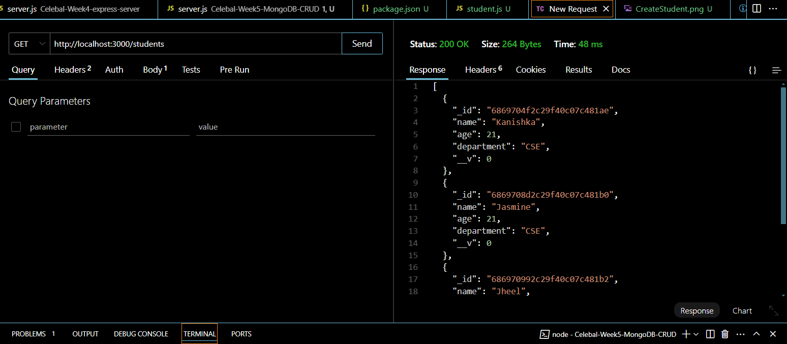
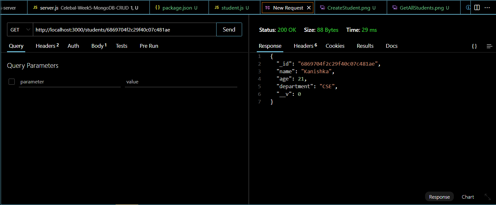
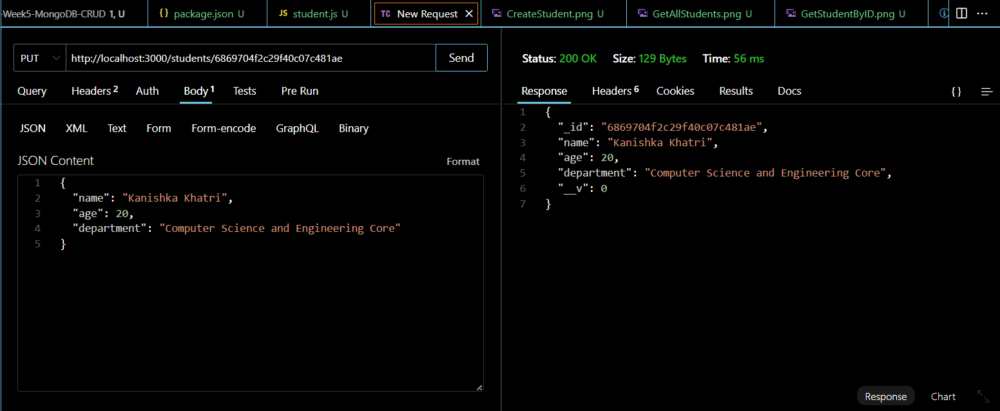
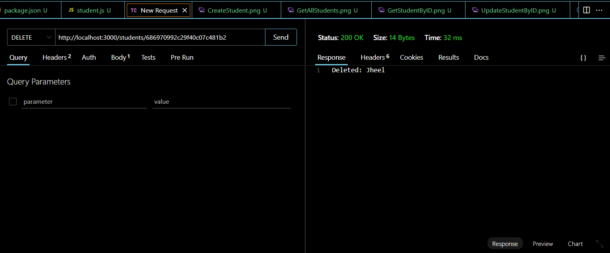
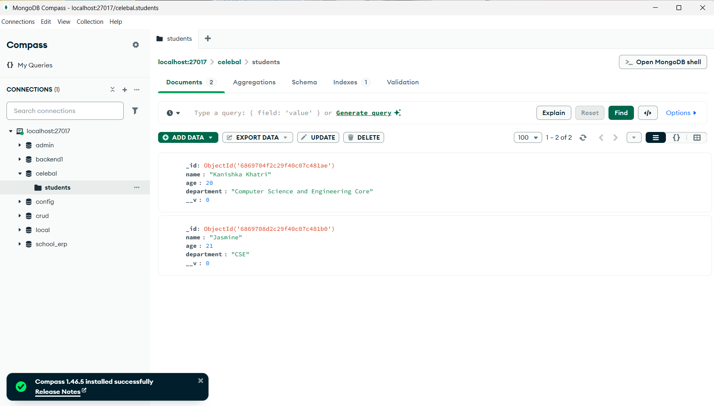

# Week 5 Assignment: MongoDB CRUD App using Express.js and Mongoose

## 📚 Description

This is a basic CRUD (Create, Read, Update, Delete) API built with **Express.js**, **MongoDB**, and **Mongoose**.  
It allows users to perform CRUD operations on a `Student` collection.

---

## 🗂️ Project Structure

```
week5-mongo-crud/
├── models/
│   └── Student.js
├── server.js
├── package.json
└── README.md
```

---

## ⚙️ Setup Instructions

1. Clone or download the project folder.
2. Install dependencies:

```bash
mkdir Celebal-Week5-MongoDB-CRUD
cd Celebal-Week5-MongoDB-CRUD
npm init -y
npm install express mongoose body-parser
```

3. Make sure MongoDB is running locally on your machine or use a MongoDB Atlas URI.
4. Update the MongoDB URI in `server.js` if needed:

```js
mongoose.connect('mongodb://localhost:27017/celebal', { ... });
```

5. Run the server:

```bash
npm start
```

The server will start on `http://localhost:3000`.

---

## 📌 API Endpoints

### ➕ Create Student

**POST** `/students`  
**Body (JSON):**
```json
{
  "name": "Kanishka",
  "age": 21,
  "department": "CSE"
}
```


---

### 📥 Get All Students

**GET** `/students`



---

### 🔍 Get a Student by ID

**GET** `/students/:id`  
Make sure `:id` is a valid MongoDB ObjectId.


---

### ✏️ Update Student

**PUT** `/students/:id`  
**Body (JSON):**
```json
{
  "name": "Kanishka Khatri",
  "age": 20,
  "department": "Compuetr Science and Engineering Core"
}
```


---

### ❌ Delete Student

**DELETE** `/students/:id`


---

## 🧪 Example curl Commands

### Create:
```bash
curl -X POST http://localhost:3000/students \
-H "Content-Type: application/json" \
-d '{"name":"Kanishka","age":21,"department":"CSE"}'
```

### Get All:
```bash
curl http://localhost:3000/students
```

### Get One:
```bash
curl http://localhost:3000/students/<student_id>
```

### Update:
```bash
curl -X PUT http://localhost:3000/students/<student_id> \
-H "Content-Type: application/json" \
-d '{"name":"Updated Name","age":22,"department":"AI"}'
```

### Delete:
```bash
curl -X DELETE http://localhost:3000/students/<student_id>
```

---
## MongoDB Interface

### Before deletion


### After deletion


---

## 💡 Notes

- Make sure MongoDB is connected before making API requests.
- Always use a valid ObjectId in place of `<student_id>`.
- The `<student_id>` used in endpoints refers to the **MongoDB ObjectId** of the student document.
- You can also test this using Postman.

---

## 👩‍💻 Author

**Kanishka Khatri**  
B.Tech CSE, Mody University of Science and Technology  
🔗 [LinkedIn Profile](https://www.linkedin.com/in/kanishka-khatri/)

📌 *Submitted for Celebal Summer Internship 2025 – Week 5 Assignment*
