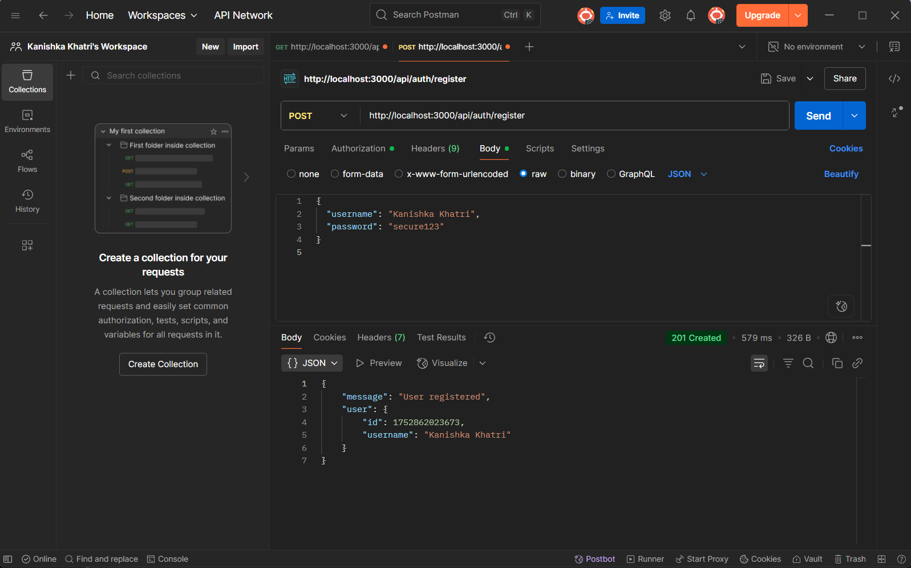

# 🔐 JWT Authentication API

A simple Express-based REST API demonstrating user registration, login with hashed passwords, and protected routes using JSON Web Tokens (JWT).

## 🚀 Features

- User Registration with hashed passwords (`bcryptjs`)
- User Login with JWT-based authentication (`jsonwebtoken`)
- Protected route with middleware
- In-memory user store (can be upgraded to DB)
- Environment variable support using `dotenv`

## 🛠️ Technologies Used

- Node.js
- Express.js
- bcryptjs
- jsonwebtoken
- dotenv

## 📁 Project Structure

```
project/
├── controllers/
│   └── authController.js
├── middleware/
│   └── auth.js
├── models/
│   └── userModel.js
├── routes/
│   └── authRoutes.js
├── .env
├── server.js
└── README.md
```

## 📝 Getting Started

### 1. Clone the repo

```bash
git clone https://github.com/kanishka-khatri/Celebal-Summer-internship.git
cd Celebal-week7-JWT-based-Auth
```

### 2. Install dependencies

```bash
npm install
```

### 3. Set up environment variables

Create a `.env` file in the root with the following content:

```env
JWT_SECRET=your_secret_key_here
JWT_EXPIRE=1h
PORT=3000
```

## 🔄 Available Routes

### Public Routes

#### `POST /api/auth/register`
Register a new user.

**Body:**
```json
{
  "username": "your_username",
  "password": "your_password"
}
```


#### `POST /api/auth/login`
Login and receive a JWT token.

**Body:**
```json
{
  "username": "your_username",
  "password": "your_password"
}
```

**Response:**
```json
{
  "token": "JWT_TOKEN_HERE",
  "expiresIn": "1h"
}
```


### 🔐 Protected Routes

#### `GET /api/auth/dashboard`

**Headers:**
```http
Authorization: Bearer JWT_TOKEN_HERE
```

**Response:**
```json
{
  "message": "Hello <username>, welcome to your dashboard!",
  "user": {
    "id": 123456,
    "username": "your_username"
  }
}
```


---
## 🚧 Future Improvements

- Replace in-memory users with MongoDB or PostgreSQL
- Add refresh tokens and logout
- Password reset flow
- Input validation with `Joi` or `express-validator`
---
## 👩‍💻 Author

**Kanishka Khatri**  
B.Tech CSE, Mody University of Science and Technology  
🔗 [LinkedIn Profile](https://www.linkedin.com/in/kanishka-khatri/)

📌 *Submitted for Celebal Summer Internship 2025 – Week 5 Assignment*
