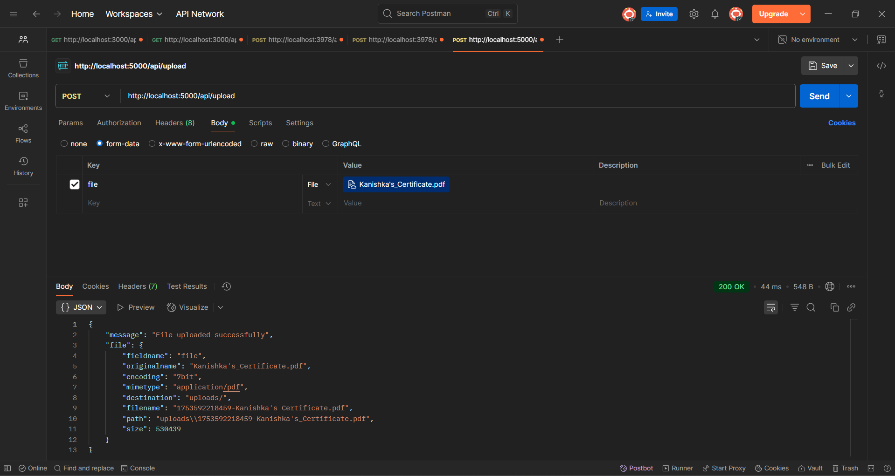
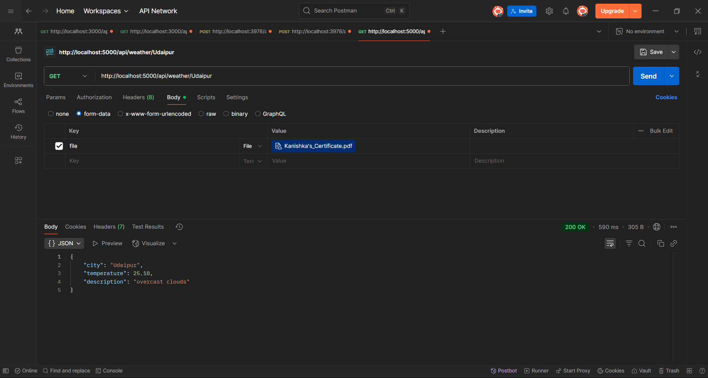

# Express.js Enhanced App – Week 8 Assignment (Celebal Internship)

This project enhances a basic Express.js application by adding the following features:
- ✅ File Upload using `multer`
- ✅ Global Error Handling Middleware
- ✅ Integration with OpenWeatherMap API

---

## 📁 Project Structure

```
Celebal-week8-express-enhanced-app/
│
├── uploads/                # For storing uploaded files
├── .env                    # Store API keys
├── app.js                  # Main entry file
├── routes/
│   ├── upload.js
│   └── weather.js
└── middleware/
    └── errorHandler.js
```

---

## ⚙️ Installation

```bash
npm install express multer axios dotenv
```

Create a `.env` file in the root directory:

```
WEATHER_API_KEY=your_openweathermap_api_key
```

---

## 🚀 Running the Application

```bash
node app.js
```

App will run on `http://localhost:5000`

---

## ✅ Testing Instructions

### 1. File Upload (Using Postman)

- Method: **POST**
- URL: `http://localhost:5000/api/upload`
- Body: `form-data`
  - Key: `file` (Type: File)
  - Value: Choose any file to upload

Expected Output:
```json
{
  "message": "File uploaded successfully",
  "file": { ... }
}
```

Uploaded files will be saved in the `uploads/` folder.

---

### 2. Weather API

- Method: **GET**
- URL: `http://localhost:5000/api/weather/Delhi`

Expected Output:
```json
{
  "city": "Delhi",
  "temperature": 30,
  "description": "clear sky"
}
```

Try invalid cities for error handling test.

---

## 📌 Notes

- Use the correct key name `file` when uploading files via Postman.
- Make sure `.env` file contains a valid OpenWeatherMap API key.
- Error handling middleware is globally applied and will catch unhandled exceptions.

---

## ✨ Author
Kanishka Khatri – Celebal Summer Internship Week 8
